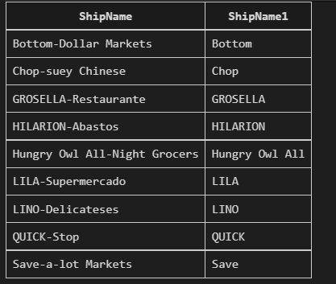

# DB1-HomeWork
# DataBase Homework 1
# Q1
```sql
select distinct ShipName, SubStr(ShipName, 1, instr(ShipName, '-') -1) as ShipName1
from 'Order'
where ShipName Like '%-%'
Order by ShipName;
```
  
# Q2
```sql
-- SQLite
SELECT 'Order'.Id,
    'Order'.ShipCountry,
    (
        CASE
            'Order'.ShipCountry
            WHEN 'USA' THEN 'NorthAmerica'
            WHEN 'Mexico' THEN 'NorthAmerica'
            WHEN 'Canada' THEN 'NorthAmerica'
            ELSE 'OtherPlace'
        END
    ) as Place
FROM 'ORDER'
WHERE Id >= 15445
ORDER BY Id
LIMIT 20
```
  
# Q3
```sql
SELECT B.CompanyName, ROUND(A.count1*1.0/B.count2,2)As Ratio
FROM
(SELECT COUNT(*) AS count1,Shipper.CompanyName
FROM 'Order',Shipper 
WHERE
    Shipper.Id='Order'.ShipVia AND
    ShippedDate > RequiredDate
GROUP BY 'Order'.ShipVia)A
NATURAL JOIN
(SELECT COUNT(*) AS count2,Shipper.CompanyName
FROM 'Order',Shipper 
WHERE
    Shipper.Id='Order'.ShipVia
GROUP BY 'Order'.ShipVia)B
Order BY Ratio DESC
```
  
# Q4
```sql
SELECT C.CategoryName,count(*)count,Round(avg(P.UnitPrice),2)avgPrice,
min(P.UnitPrice)minPrice,max(P.UnitPrice)maxPrice,Sum(P.UnitsOnOrder)sumOrder
FROM Product P,Category C
WHERE C.Id=P.CategoryId
GROUP BY P.CategoryId
HAVING count(*)>10
```
  
# Q5
```sql
SELECT a.ProductName,a.CompanyName,a.ContactName
FROM
(SELECT a.ProductName,a.CompanyName,a.ContactName,min(a.OrderDate)
FROM
    (SELECT P.ProductName,C.CompanyName,C.ContactName,P.Id,O.OrderDate
    From Product P,Customer C,'Order' O,OrderDetail OrD
    WHERE P.DiScontinued=1 AND
        C.Id=O.CustomerId AND
        O.Id=OrD.OrderId AND
        P.Id=OrD.ProductId
    )a INNER JOIN
    (SELECT P.Id FROM Product P WHERE DiScontinued=1)b
    ON a.Id=b.Id
GROUP BY ProductName)a
```
  
# Q6
```sql
SELECT Id,a.OrderDate,lag(a.OrderDate,1,OrderDate) OVER (ORDER BY a.OrderDate)as Previous,
ROUND(julianday(a.OrderDate)-julianday(lag(a.OrderDate,1,OrderDate)OVER (ORDER BY a.OrderDate)),2)as diff
FROM(SELECT O.OrderDate,O.Id
    FROM Customer C,'Order' O
    WHERE C.Id='BLONP' AND
        O.CustomerId='BLONP'
    LIMIT 10
    )a

```
  
# Q7
```sql
WITH total AS(
SELECT *,ntile(4) OVER(Order BY sum) as buckets
FROM(SELECT O.CustomerId,ROUND(sum(ORD.UnitPrice*Quantity),2)as sum
    FROM 'Order' O,OrderDetail ORD
    WHERE
        ORD.OrderId=O.Id
    GROUP BY O.CustomerId
    ORDER BY sum)a
)

SELECT 'MISSING_NAME'as CompanyName,CustomerId,sum
FROM total 
WHERE total.CustomerId not in(SELECT C.Id FROM Customer C)

UNION

SELECT ifNull(C.CompanyName,'MISSING_NAME'),C.Id,sum
FROM total,Customer C
WHERE total.CustomerId=C.Id
    AND total.buckets=1
ORDER BY sum

```
  
# Q8
```sql
SELECT R.RegionDescription,FirstName,LastName,BirthDate
FROM Employee E,EmployeeTerritory EmpT,Territory T,Region R
WHERE E.id=EmpT.EmployeeId AND
    EmpT.TerritoryId=T.Id AND
    R.Id=T.RegionId
GROUP BY R.RegionDescription
```
  
# Q9
```sql
(SELECT P.ProductName,P.Id
    FROM Product P,Customer C,'Order' O,OrderDetail OrD
    WHERE  
            C.Id=O.CustomerId AND
            O.Id=OrD.OrderId AND
            P.Id=OrD.ProductId AND
            C.CompanyName='Queen Cozinha' AND
            O.OrderDate LIKE '%2014-12-25%'
            Order by P.id
)
```
  
